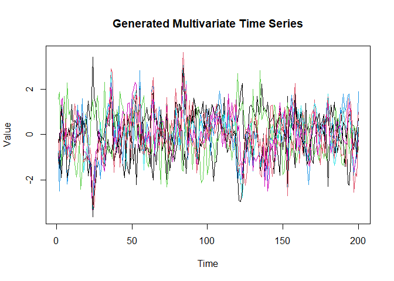
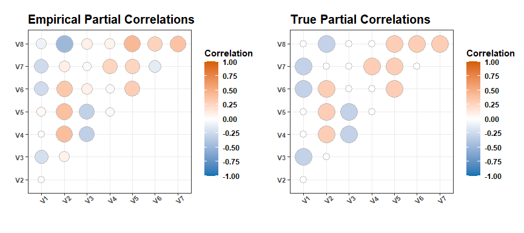
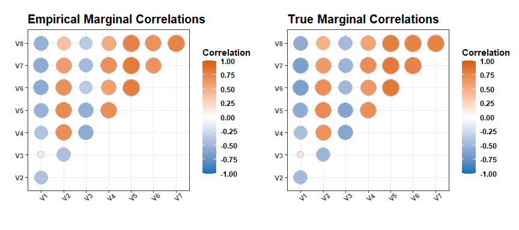

# pcCov

Inference of Partial Correlations for Multivariate Time Series

## Description

This R package implements methods for inference of partial correlations for a stationary and ergodic Gaussian process. Methods of inference are based on second-order Taylor Series approximation of the covariances of the partial correlations.

</p>

# Table of contents

  - [Overview of main functions](#overview-main)
  - [Installation](#install)
  - [Examples](#examples)
  - [References](#refs)

<h2 id="overview-main">

Overview of main functions

</h2>

<table>
<colgroup>
<col style="width: 28%" />
<col style="width: 71%" />
</colgroup>
<thead>
<tr class="header">
<th>Function</th>
<th>Description</th>
</tr>
</thead>
<tbody>
<tr class="even">
<td><code>partialCov</code></td>
<td>Calculates a second-order Taylor Series estimate of the covariance matrix for partial correlations of a stationary Gaussian process.</td>
</tr>
<tr class="odd">
<td><code>bootVar</code></td>
<td>Calculates block-bootstrap covariance matrix estimates and confidence intervals for partial correlations of a multivariate time series.</td>
</tr>
<tr class="even">
<td><code>royVar</code></td>
<td>Calculates Roy (1989)'s asymptotic covariance matrix for marginal or partial correlations.</td>
</tr>
<tr class="odd">
<td><code>royVarhelper</code></td>
<td>Calculates matrix of indices for assisting in efficient calculation of asymptotic covariance matrix estimate using either royVar_cpp() or partialCov_cpp()</td>
</tr>
<tr class="even">
<td><code>vcm_cpp</code></td>
<td>Implements the a variance components model proposed by Fiecas et al. (2017).</td>
</tr>
<tr class="odd">
<td><code>varSim</code></td>
<td>Simulates data from a mean 0 first-order vector auto-regressive (VAR) model.</td>
</tr>
<tr class="even">
<td><code>corrMat_cpp</code></td>
<td>Calculates marginal or partial correlation matrix.</td>
</tr>
<tr class="odd">
<td><code>varSim</code></td>
<td>Simulates data from a mean 0 first-order vector auto-regressive (VAR) model.</td>
</tr>
<tr class="even">
<td><code>invCov2part_cpp</code></td>
<td>Calculates partial correlation matrix from the inverse-covariance matrix.</td>
</tr>
<tr class="odd">
<td><code>bdiagArray_cpp</code></td>
<td>Constructs a block-diagonal matrix from a 3D array.</td>
</tr>
<tr class="even">
<td><code>eigenMult2</code></td>
<td>Efficiently multiplies two matrices. Similar functions are available for 3 (`eigenMult3`) and 4 (`eigenMult4`) matrices.</td>
</tr>
</tbody>
</table>

<h2 id="install">

Installation

</h2>

Install the latest version of the package from GitHub with the following R code:

    if("devtools" %in% installed.packages() == FALSE) {
        install.packages("devtools")
    }
    
    # Installing from GitHub
    devtools::install_github("dilernia/pcCov")

<h2 id="examples">

Examples

</h2>

Here we will walk through brief examples of using some key functions.

Demonstration of using pcCov
================

## Simulate multivariate time series data

First, we simulate data from a first-order autoregressive (AR(1)) model
for demonstration purposes.

``` r
library(pcCov)

# Number of variables (p), AR correlation parameter (phi), 
# length of time series (N), all true partial correlations being 0 or not (allZero)
p <- 8
phi <- 0.50
N <- 200
allZero <- FALSE

# Generating true precision matrix
set.seed(1994)
q <- choose(p, 2)
precMat <- diag(0.50, p)
triInds <- upper.tri(diag(p))
precMat[triInds] <- sample(c(-0.30, 0, 0.30), size = q, replace = T) * (!allZero)

precMat <-  precMat + t(precMat)

# Making sure still positive definite
eVals <- eigen(precMat)$values
if(any(eVals <= 0)) {
  precMat <- precMat + diag(abs(min(eVals)) + 0.001, p)
}

# True covariance and correlation matrices
pc0Mat <- invCov2part_cpp(precMat)
colnames(pc0Mat) <- rownames(pc0Mat) <- paste0("V", 1:p)

pc0s <- pc0Mat[triInds]
cvMat <- solve(precMat)

r0Mat <- cov2cor(cvMat)
r0s <- r0Mat[triInds]
colnames(r0Mat) <- rownames(r0Mat) <- paste0("V", 1:p)

# Generating data from AR model
myTS <- scale(varSim(nt = N, coeffMat = diag(p)*phi, 
                       covMat = cvMat))
```

We can visualize this simulated data set:

``` r
# Plotting generated time series
matplot(myTS, type = 'l', lty = "solid", 
        main = "Generated Multivariate Time Series",
        xlab = "Time", ylab = "Value")
```



Next, we calculate the partial correlations for the artificial data set
and see how similar they are to the true correlations.

``` r
library(ggplot2)
library(ggcorrplot)
library(grid)
library(tidyverse)

# Empirical partial correlations
pcMat <- corrMat_cpp(tsData = myTS, partial = TRUE)
pcEsts <- pcMat[triInds]
colnames(pcMat) <- rownames(pcMat) <- paste0("V", 1:p)

# Creating common plot function
corrPlot <- function(corrMatrix, myTitle) {
  ggcorrplot::ggcorrplot(corrMatrix, method = "circle", type = "upper") + 
  scale_fill_gradient2(high = "#D55E00", low = "#0072B2", mid = "white",
                       limits=c(-1,1), breaks = seq(-1, 1, by = 0.25)) + 
  labs(x = "", y = "", fill = "Correlation", title = myTitle) + 
    theme_bw() + theme(legend.key.height = unit(1, "cm"), text = element_text(face = "bold"),
      axis.text.y = element_text(size = 8, face = "bold"),
      axis.text.x = element_text(size = 8, face = "bold", angle = 45),
      plot.title = element_text(size = 15, face = "bold"))
}

# Plot for partial correlations
pcPlot <- corrPlot(pcMat, myTitle = "Empirical Partial Correlations") %>% ggplot2::ggplotGrob()
pc0Plot <- corrPlot(pc0Mat, myTitle = "True Partial Correlations") %>% ggplot2::ggplotGrob()

pc0Plot$heights <- pcPlot$heights
pc0Plot$widths <- pcPlot$widths

grid::grid.draw(cbind(pcPlot, pc0Plot))
```



## Inference of partial correlations for time series data

Now, we use an asymptotic covariance estimator based on a second-order
Taylor Series expansion and properties of quadratic forms of
multivariate normal random vectors. For demonstration purposes, we
construct 95% Wald confidence intervals for each of the *p*(*p* − 1)/2=
28 partial correlations.

``` r
# Calculating asymptotic covariance estimator for partial correlations w/
# finite sample correction
pcCov <- partialCov(ts = myTS) / (N - p) * N

# Taylor confidence intervals
zstar <- qnorm(0.975)
indvCIs <- cbind(pcEsts - zstar * sqrt(diag(pcCov)), 
                 pcEsts + zstar * sqrt(diag(pcCov)))

# Capture rate
capRate <- mean(sapply(1:q, FUN = function(j) {
  (pc0s[j] >= indvCIs[j, 1]) && (pc0s[j] <= indvCIs[j, 2])}))

capRate
```

    ## [1] 0.9642857

We can also calculate 95% confidence intervals using a block-bootstrap
approach.

``` r
# Optimal bandwidth
banw <- ceiling(mean(np::b.star(myTS)[, 1]))

# Block-Bootstrap intervals
bootSummary <- bootVar(ts = myTS, banw)
bootCIs <- bootSummary[[2]]

# Block-bootstrap intervals
bootCapRate <- mean(sapply(1:q, FUN = function(j) {
  (pc0s[j] >= bootCIs[j, 1]) && (pc0s[j] <= bootCIs[j, 2])}))

bootCapRate
```

    ## [1] 0.9642857

## Inference of marginal correlations for time series data

Through a similar process, we can also conduct inference of marginal
correlations using Roy (1989)’s covariance estimator.

``` r
# Empirical marginal correlations
rMat <- corrMat_cpp(tsData = myTS, partial = FALSE)
rEsts <- rMat[triInds]
colnames(rMat) <- rownames(rMat) <- paste0("V", 1:p)

# Plot for marginal correlations
rPlot <- corrPlot(rMat, myTitle = "Empirical Marginal Correlations") %>% ggplot2::ggplotGrob()
r0Plot <- corrPlot(r0Mat, myTitle = "True Marginal Correlations") %>% ggplot2::ggplotGrob()

r0Plot$heights <- rPlot$heights
r0Plot$widths <- rPlot$widths

grid::grid.draw(cbind(rPlot, r0Plot))
```



``` r
# Calculating asymptotic covariance estimator for marginal correlations
rCov <- royVar(ts = myTS, partial = FALSE)

# Taylor confidence intervals
zstar <- qnorm(0.975)
rindvCIs <- cbind(rEsts - zstar * sqrt(diag(rCov)), 
                 rEsts + zstar * sqrt(diag(rCov)))

# Capture rate
rcapRate <- mean(sapply(1:q, FUN = function(j) {
  (r0s[j] >= rindvCIs[j, 1]) && (r0s[j] <= rindvCIs[j, 2])}))

rcapRate
```

    ## [1] 0.9642857


<h2 id="refs">

References

</h2>

Fiecas, M., Cribben, I., Bahktiari, R., and Cummine, J. (2017). A variance components model for statistical inference on functional connectivity networks. *NeuroImage*, 149, 256-266.

Politis, D.N. and H. White (2004), Automatic block-length selection for the dependent bootstrap, *Econometric Reviews* 23(1), 53-70.

Roy, R. (1989). Asymptotic covariance structure of serial correlations in multivariate time series, *Biometrika*, 76(4), 824-827.


